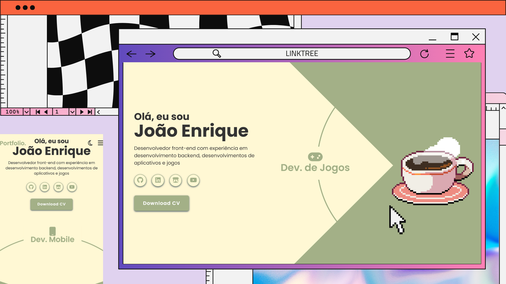
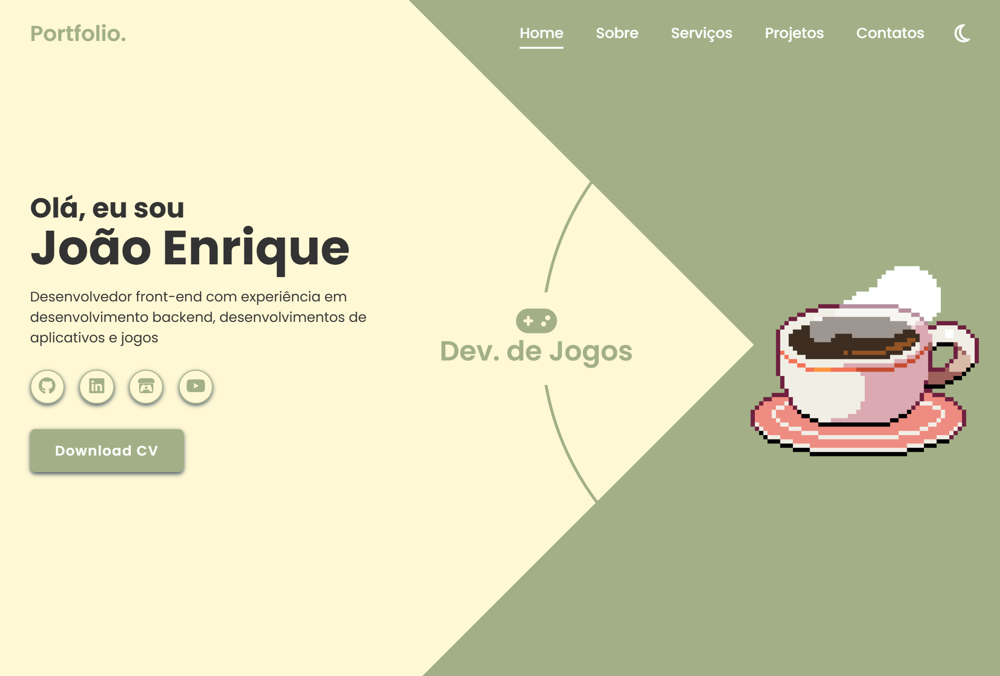
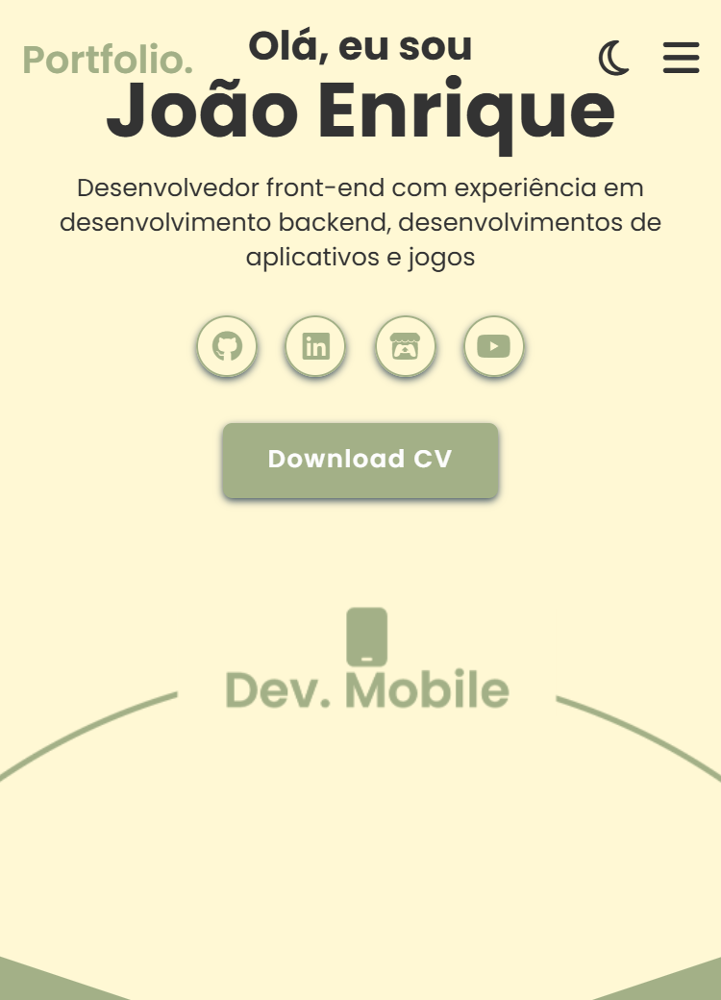

# 💼 Portfólio Pessoal — João Enrique
> Meu portfólio desenvolvido com **HTML, CSS e JavaScript**, criado para apresentar meus projetos e formas de contato de maneira moderna e responsiva.

---

## 🚀 Demonstração
🔗 **Acesse o projeto:** [link-do-deploy-aqui](https://meu-portfolio-lemon-sigma.vercel.app/)  

📸 **Preview:**  


---

## 📚 Sumário
- [Sobre o Projeto](#-sobre-o-projeto)
- [Tecnologias](#️-tecnologias)
- [Funcionalidades](#-funcionalidades)
- [Como Rodar o Projeto](#-como-rodar-o-projeto)
- [Como Usar](#-como-usar)
- [Screenshots](#️-screenshots)
- [Aprendizados](#-aprendizados)
- [Estrutura de Pastas](#-estrutura-de-pastas)
- [Roadmap](#-roadmap)
- [Links Úteis](#-links-úteis)
- [Autor](#-autor)
- [Licença](#-licença)

---

## 💡 Sobre o Projeto
Este portfólio foi desenvolvido para **apresentar meus projetos, experiências e habilidades** na área de desenvolvimento.  
A interface foi construída com **HTML, CSS e JavaScript puro**, com foco em **design moderno, responsividade e performance**.

O site também inclui **animações sutis, modo escuro, e um formulário de contato funcional**.

---

## 🛠️ Tecnologias
As principais tecnologias utilizadas neste projeto foram:

- **HTML5**
- **CSS3** (Flexbox, Grid, Animações, Responsividade)
- **JavaScript**
- **Live Server** (para rodar localmente)

> 💡 O formulário de contato utiliza integração com **FormSpree**.

---

## 📚 Funcionalidades
- [x] Seção “Sobre mim” com apresentação e foto  
- [x] Seção de **projetos** com links e previews  
- [x] Seção de **Seviços** com ícones das tecnologias  
- [x] **Formulário de contato funcional**  
- [x] **Design responsivo** e adaptado para diferentes telas  
- [x] **Animações suaves** em scroll e hover  
- [x] Modo escuro

---

## 📦 Como Rodar o Projeto
Siga as etapas abaixo para executar o projeto localmente:

```bash
# Clone este repositório
git clone https://github.com/joao-enrique/meu-portfolio.git

# Acesse a pasta do projeto
cd portfolio-joao-enrique

# Abra o projeto com o Live Server
# (Clique com o botão direito no arquivo index.html e selecione "Open with Live Server")
```

> 💡 Caso não tenha o Live Server instalado, procure a extensão “Live Server” no VS Code Marketplace e instale.

---

## 🧪 Como Usar
1. Abra o arquivo index.html com o Live Server.
2. Navegue pelas seções (Home, Sobre, Projetos, Contato).
3. Clique nos links dos projetos para ser redirecionado aos repositórios ou deploys.
4. Utilize o formulário de contato para enviar mensagens (caso configurado).

---

## 🖼️ Screenshots
### 💻PC

### 📲 Tablet

### 📱 Mobile


---

## 🧠 Aprendizados
- Durante o desenvolvimento deste projeto, aprimorei:
- Organização e semântica no HTML;
- Uso de CSS avançado (animações, glassmorphism, variáveis e media queries);
- Manipulação do DOM com JavaScript;
- Melhoria na estrutura de layout responsivo;
- Integração de formulários via serviços externos (FormSubmit ou alternativos).

---

## 📁 Estrutura de Pastas
/ </br>
├─ index.html </br>
├─ css/ </br>
│  └─ style.css </br>
├─ js/ </br>
│  └─ script.js </br>
├─ images/ </br>
└─ README.md </br>

---

## 🚧 Roadmap
- [] Implementar tema escuro automático
- [] Traduzir para versão em inglês
- [] Adicionar seção de certificados e cursos

---

## 🔗 Links Úteis
🌐 Deploy: [link](https://meu-portfolio-lemon-sigma.vercel.app/)  </br>
💼 LinkedIn: [link](https://www.linkedin.com/in/joao-enrique-dev/) </br>
🧠 GitHub: [link](https://github.com/joao-enrique) </br>
🎮 Itch-io: [link](https://jedev1.itch.io/) </br>
📹 YouTube: [link](https://www.youtube.com/@joaocodedev) </br>
✨ Linktree: [link](https://linktree-eight-gules.vercel.app/) </br>

## 👨‍💻 Autor
Feito com 💜 por [João Enrique](https://linktree-eight-gules.vercel.app/)
<div align="right">
  <a href="https://www.linkedin.com/in/joao-enrique-dev/" target="_blank">
    
  </a>
  <a href="https://www.youtube.com/@joaocodedev" target="_blank">
    
  </a>
  <a href="https://jedev1.itch.io/" target="_blank">
    
  </a>
</div>

---

## 📜 Licença
Este projeto está sob a licença **MIT** — veja o arquivo [LICENCE](./LICENSE) para mais detalhes.

### ⭐ Se este projeto te inspirou, não esqueça de deixar uma **estrela** no repositório!